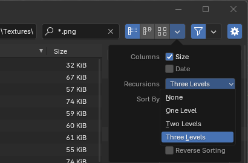
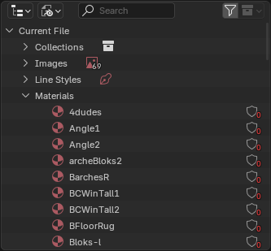

# Importing a map with textures

This guide utilizes Blender 4.2 LTS and [Unreal Tournament v439](https://github.com/OldUnreal/UnrealTournamentPatches).

CTF-Face will be used as an example.

1. [Create Blender material libraries from UTX packages](#create-blender-material-libraries-from-utx-packages)
	1. [Export textures from UnrealED](#export-textures-from-unrealed)
	2. [Create a Blender material library](#create-a-blender-material-library)
		- [Older Blender versions](#older-blender-versions)
2. [Import a map](#import-a-map)
	1. [Link required material libraries](#link-required-material-libraries)
	2. [Import the T3D map](#import-the-t3d-map)


## Create Blender material libraries from UTX packages

### Export textures from UnrealED
We first need to export UT textures to png files.
Let's start with ShaneChurch.utx.
After starting up UnrealED, open this file using the Texture Browser, then use:

File ‣ Batchexport to PNG from Package...  


This will create a folder named after the texture package in the UT directory. It contains a *Textures* folder with the png files.

### Create a Blender material library

We will create a .blend file that will contain those textures ready to be used as materials. 

Open Blender and use:  
3D Viewport ‣ Add ‣ Image ‣ Mesh Plane

Since there are often subfolders in *Textures*, enable the Recursion option:  


Use these options on the right side:

- Material / Backface Culling = Checked.
- Texture / Extension = Repeat.


Press A to select all the png files, and click *Import Images as Planes*.

We now have a lot of planes in the scene view. All the objects in the scene can be deleted as we just need the materials.

You can view the materials contained within a blend file by using the Outliner in Blender File display mode.


Save this project using File ‣ Save As… "ShaneChurch.blend".

This blend file is now ready to be linked or appended from another project.

This procedure must be repeated for every package you need.
In the case of CTF-Face, the main ones would be ShaneChurch, SkyCity and UTtech1.

#### Older Blender versions

Blender versions prior to 4.2 offer the Import Images as Planes feature through an official add-on that needs to be activated first.


Once enabled, it's available at:  
File ‣ Import ‣ Images as Planes

The steps are similar, but the add-on lacks options for backface culling and repeat, therefore we need to fix textures after importing using this script, ran from the Scripting tab:

```
import bpy
for m in bpy.data.materials:
    m.use_backface_culling=True
    m.show_transparent_back=False
    if m.node_tree and m.node_tree.nodes.get("Image Texture"):
        m.node_tree.nodes["Image Texture"].extension="REPEAT"
```

## Import a map

### Link required material libraries

Create a new project.

Link the library using:  
File ‣ Link...  

In the file browser, open the .blend library, then its *Material* folder, press A to select all materials, and click Link.
The materials are now available in our project.
Repeat this procedure for every library you need.

### Import the T3D map

We're now ready to import the map using the blender_t3d add-on. This step must come last after all the necessary materials are linked, because the script can only assign materials that exist.
Whenever a required material wasn't found, the script will output a warning.

File ‣ Import ‣ Import Unreal .T3d (t3d) 

Remember to adjust view to Material preview so that textures can be displayed, and set a large enough clipping distance.


---
