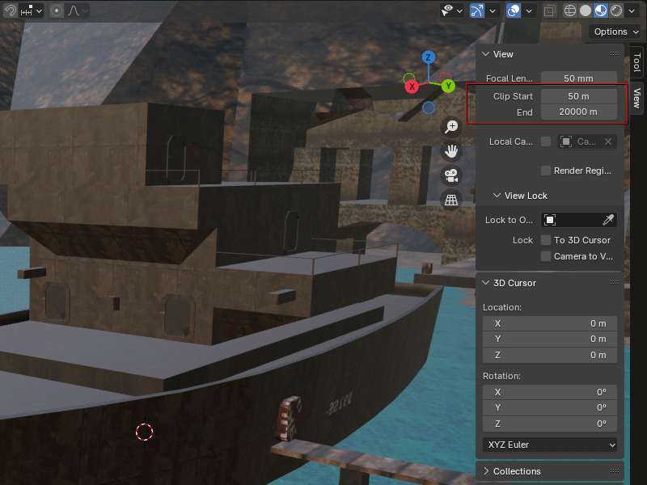

# blender_t3d

Import-Export add-on for old UnrealED .T3D files.

## Installation

This requires at least Blender 3.3 LTS.

Download the [latest release](https://github.com/crapola/blender_t3d/releases/latest).  
Blender: Edit > Preferences > Add-ons > Install...  
In the open file dialog, select the archive and press "Install Add-on".

## Usage

The add-on adds the following menu items:

`File > Import > Import Unreal .T3D (.t3d)` \
`File > Export > Export Unreal .T3D (.t3d)` \
`Object > Export T3D to clipboard` to paste directly selected mesh(es) into the clipboard.

## Notes

* Unreal uses larger units than Blender, so you might need to adjust camera clip when importing large maps.

If you want to use UT texture in Blender, see [texturing](texturing/instructions.md).